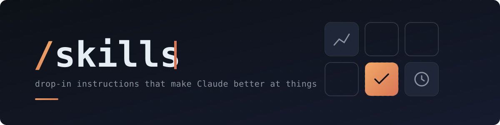

<p align="center">
  
</p>

<p align="center">
  <a href="LICENSE"></a>
  
  <a href="https://docs.claude.com/en/docs/claude-code/skills"></a>
  <a href="https://github.com/HarmonicHemispheres/skills/commits/main"></a>
  <a href="https://github.com/HarmonicHemispheres/skills/stargazers"></a>
</p>

# skills

Here are the skills I use all the time.

## Skills

| Skill | What it does |
|---|---|
| [`make-it-visual`](make-it-visual/SKILL.md) | Visual-first design rules for mockups, reports, decks, and dashboards: show, don't tell. [Example](make-it-visual/examples/customer-portal.png) |

## Install

Copy a skill folder into your Claude skills directory:

```bash
git clone https://github.com/HarmonicHemispheres/skills.git
cp -r skills/make-it-visual ~/.claude/skills/
```

## License

[MIT](LICENSE) © Robby Boney
