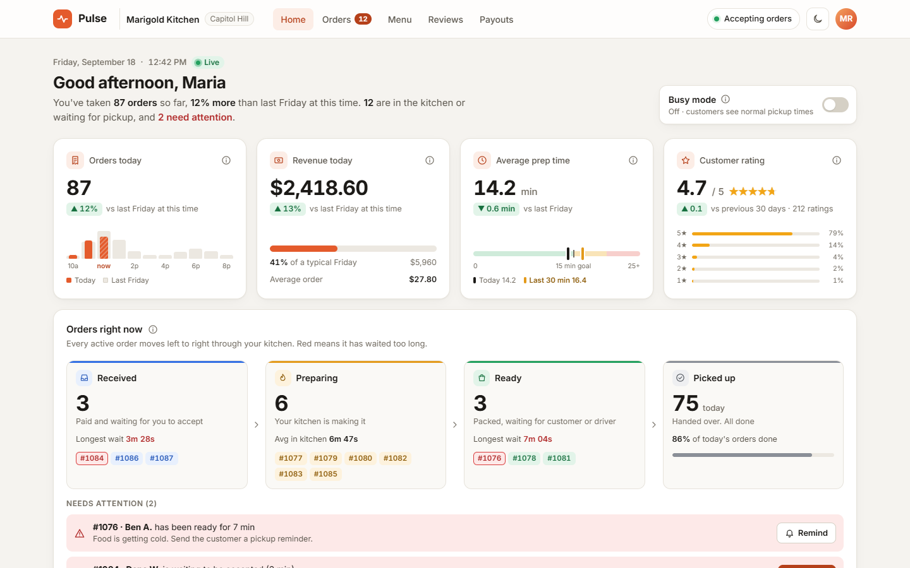
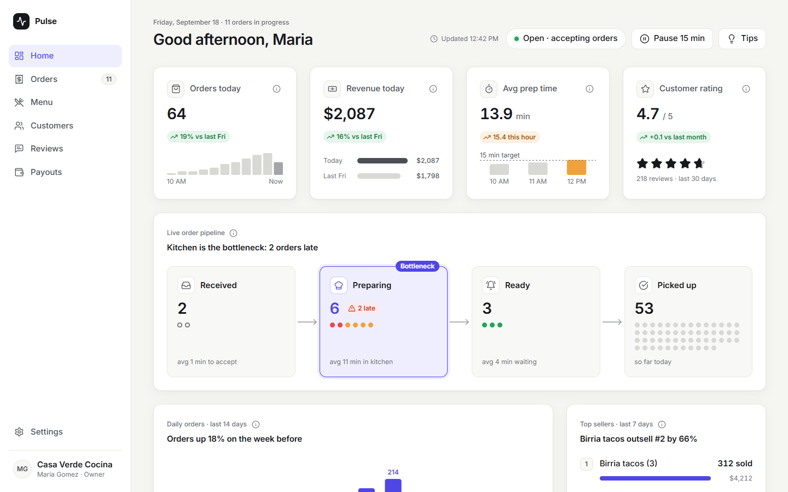

<p align="center">
  
</p>

<p align="center">
  <a href="LICENSE"></a>
  
  <a href="https://docs.claude.com/en/docs/claude-code/skills"></a>
  <a href="https://github.com/HarmonicHemispheres/skills/commits/main"></a>
  <a href="https://github.com/HarmonicHemispheres/skills/stargazers"></a>
</p>

# skills

Here are the skills I use all the time.

## Skills

| Skill | What it does |
|---|---|
| [`make-it-visual`](make-it-visual/SKILL.md) | Visual-first design rules for mockups, reports, decks, and dashboards: show, don't tell. [Example](make-it-visual/examples/customer-portal.png) |

## Does it help?

Same prompt, a restaurant-orders dashboard that "explains each metric and includes tips", built once with `make-it-visual` and once without:

| Without skill | With `make-it-visual` |
|---|---|
|  |  |
| 714 words on screen · 13 text sizes · titles name the subject | 332 words on screen · 3 text sizes · titles state the takeaway |

Scored against the skill's own rules: 8/8 checks with the skill, 6/8 without. [Method, scores, and how to rerun →](make-it-visual/evals/)

## Install

**Claude Code**: add this repo as a plugin marketplace, then install any skill:

```
/plugin marketplace add HarmonicHemispheres/skills
/plugin install make-it-visual@harmonic-hemispheres
```

**claude.ai / Claude Desktop**: download [`make-it-visual.zip`](https://github.com/HarmonicHemispheres/skills/releases/latest/download/make-it-visual.zip) from the [latest release](https://github.com/HarmonicHemispheres/skills/releases/latest) and upload it under **Customize → Skills**.

**Manual**: every release also has a `.skill` file (the same archive). Unzip it into your skills folder:

```bash
curl -LO https://github.com/HarmonicHemispheres/skills/releases/latest/download/make-it-visual.skill
unzip make-it-visual.skill -d ~/.claude/skills/
```

<details>
<summary>Releasing (maintainers)</summary>

`python scripts/build_skills.py` validates every skill and writes `dist/<name>.skill` + `dist/<name>.zip`. Publishing a GitHub release (`gh release create v0.1.0 --generate-notes`) runs the same build in CI and attaches the files to the release. New skill? Add its folder and a matching entry in `.claude-plugin/marketplace.json`.

</details>

## License

[MIT](LICENSE) © Robby Boney
